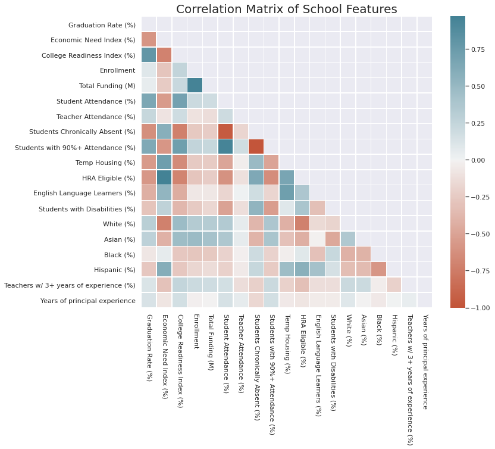
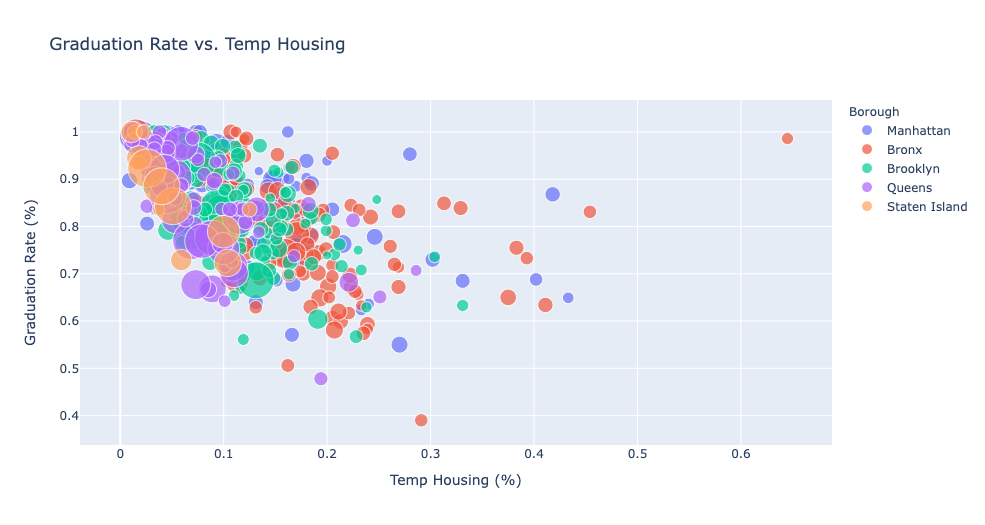
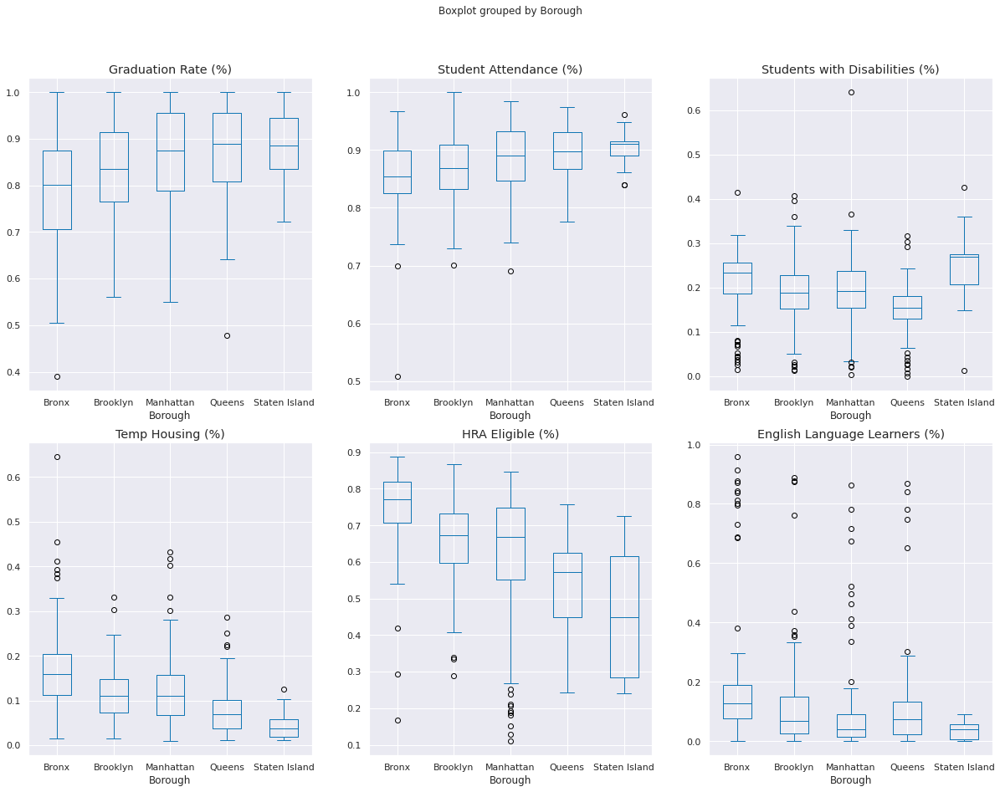
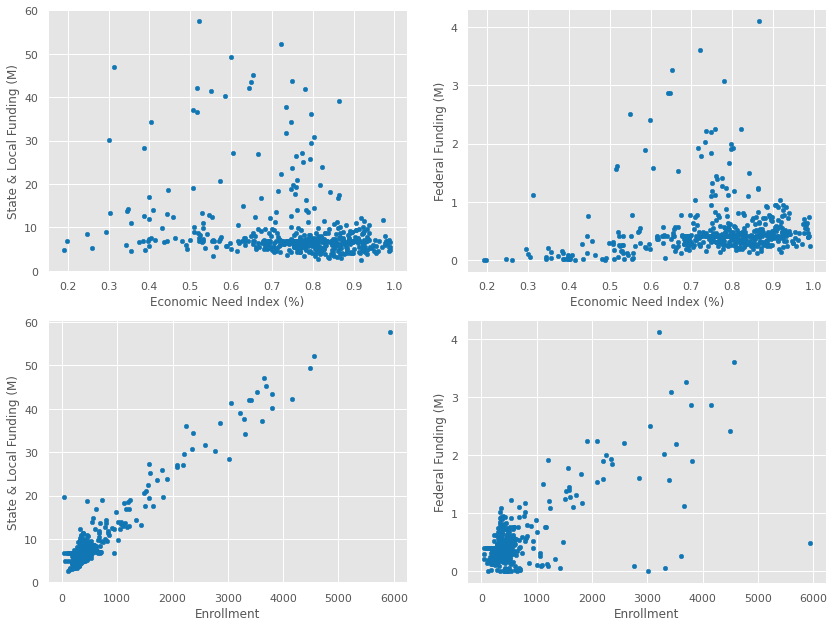
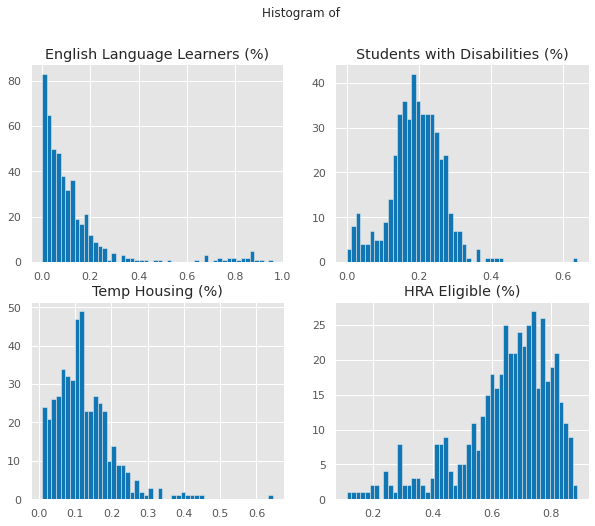
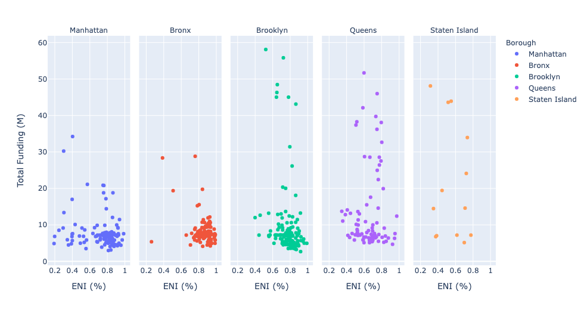

# Team 23: High Performance Factors in NYC High Schools

#### This 13-week research project was done as part of the *Correlation-One Data Science for All* program.
## Project Overview
* Extracted 486 high school demographic and financial data from the NYC Department of Education Infohub
* Performed exploratory data analysis
* Optimized a multiple linear regression to help explain our data
* Built a Tableau storyboard to visually communicate our insights
* Created a Datafolio

## Guiding Questions
1. In what way is school funding allocated to address socio-economic need?
2. How does societal disparities affect graduation rate? 
3. What are some implementations that can improve graduation rates in NYC?

>New York City is the largest public school district in the United States with 1.1 million students enrolled in K-12 schools across the city. Out of this number, over **290,000 students** go to one of the **486 public high schools** across the five boroughs. Our project investigate the factors that influence high performance in New York City high school. All of our project data comes from the New York City Department of Education. We measure high proformance based on the data collected for four year high school graduation rate. Thus, we begin with our question: **what factors influence high performance in New York City public high schools?** 

## Dataset Details
1. **Dataset Title:** School Quality Reports
    * **Filename:** 201819_hs_sqr_results.xlsx
    * **Source:** https://infohub.nyced.org/reports/school-quality/school-quality-reports-and-resources/school-quality-report-citywide-data
    * **Attributes:** 
    >  1. DBN - Unique Identifier (District - Borough - Number)
    >  2. Economic Need Index - Index created by NYC DOE to measure the economic need based on social situations of the students and their families
    >  3. Demographics [Asian (%), White(%), Black (%), etc.] - Percentage of racial group for each school.
    >  4. Social Indicators [Graduation Rate (%), Temp Housing (%), HRA Eligible (%), etc) - Percentage of school students that corresponds to specified attribute

2. **Dataset Title:** School Transparency
    * **Filename:** NewYorkCitySchoolTransparency201819 A-E web.xlsx
    * **Source:** https://infohub.nyced.org/reports/financial/financial-data-and-reports/new-york-state-school-funding-transparency-forms
    * **Attributes:** 
    >  1. Funding Source [Federal Funding, State & Local Funding] - Schools founding source amount by corresponding attribute.

    
3. **Dataset Title:** School Location
    * **Filename:** 2010-2016-School-Safety-Report.csv
    * **Source:** https://www.kaggle.com/new-york-city/ny-2010-2016-school-safety-report/home
    * **Attributes:** 
    >  1. Latitude & Longitude - Coordinates of school location

## Data Cleaning
After extracting and merging the mentioned data frames, our team made the following changes:
* Converted funding attribute to in millions 
* Made column for NYC borough school was located in
* Created N-counts version columns of attributes that were in percentage:
  *   Economic Need Index (%) -> Economic Need Index
  *   Hispanic (%) -> Hispanic
* Imputed NaN values, which happened to only come from funding data, with the median due to outliers in data
* For data that had **"N<15"** values, we imputed it with the average
* For data that had **"."** values, we imputed it with the average
* Renamed all attributes for a consise data frame.
* Created a classifying feature for schools graduation rates:
  * High Graduation - if graduation rate greater than 95%
  * Medium Graduation -  if graduation rate between 80% and 90%
  * Low Graduation -  if graduation rate less than 80%
* Established correct data types for each attribute

## Exploratory Data Analysis
Below are some few highlights from my EDA:

## Modeling

## Datafolio

## Tableau Storyboard

## Contributors

**Team 23 Members:**

Bryan Garcia 

Noah Morton

Jarrell Cooper

Essence Carson

